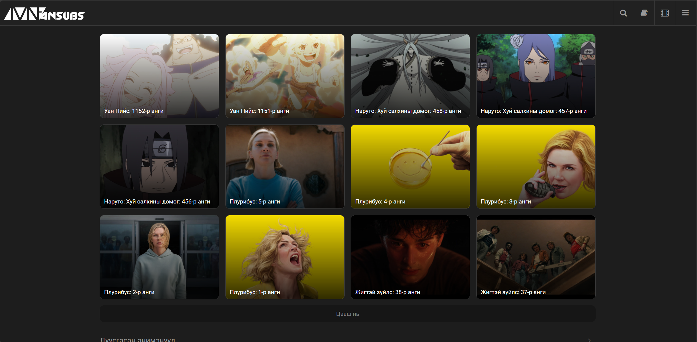

# 💻 Лаб Дизайн — Flex Layout ашиглан загвар дуурайлгах заавар


---

##  1. Ашиглагдах үндсэн HTML тэгүүд

Доорх тэгүүд интерфэйс бүтээхэд зайлшгүй шаардлагатай:

* `<header>` — Дээд навигацийн хэсэг
* `<nav>` — Лого, хайлт, товчлуурууд байрлах хэсэг
* `<section>` — Контентын үндсэн блокууд
* `<div>` — Карточ, wrapper болон grid–ийн энгийн блок
* `` — Зураг байрлуулах
* `<p>` — Текст тайлбар
* `<h3>` `<h4>` — Гарчиг
* `<button>` — Товчлуурууд
* `<i>` — Icon байрлуулах (FontAwesome гэх мэт)

---

##  2. Ашиглагдах өнгөний код

| Төрөл                     | Өнгө              | Код       |
| ------------------------- | ----------------- | --------- |
| Background Dark           | Хар–саарал        | `#1A1A1A` |
| Card Background           | `#222222`         |           |
| Text Main                 | Цагаан            | `#FFFFFF` |
| Text Secondary            | Саарал            | `#C5C5C5` |
| Highlight Yellow          | Шар               | `#F4D03F` |
| Transparent black overlay | `rgba(0,0,0,0.4)` |           |

---

##  3. Ашиглагдах CSS property–ууд (тайлбартай)

### Layout & Flex

* `display: flex;` — Элементүүдийг flex container болгоно
* `flex-direction:` row/column — Элементүүдийн байрлалыг тодорхойлно
* `flex-wrap:` wrap — Дотор элементүүд багтахгүй бол шинэ мөр рүү шилжүүлнэ
* `justify-content:` space-between/center — Хэвтээ байрлал
* `align-items:` center — Босоо байрлал
* `gap:` 10px 20px — Элемент хоорондын зай

###  Card дизайн

* `border-radius:`  — Элементийн буланг дугуй болгож UI-г илүү зөөлөн, харахад цэгцтэй болгодог.

* `background-color:` #222 — Харанхуй фон

### 📷 Зурагтай ажиллах

* `object-fit: cover;` — Зургийг пропорц алдагдуулахгүйгээр тайрч байрлуулна
* `width: 100%; height: 100%;` — Карточ дотор бүтэн дүүргэнэ

### 🔤 Текст

* `font-size:` 14px / 16px — Текстийн хэмжээ
* `font-weight:` 500 / 600 — Текстийн зузаан
* `position: absolute; bottom: 10px;` — Зураг дээр текстийг суулгах

---

##  4. ICON гэж юу вэ?

**Icon (тэмдэг)** гэдэг нь веб дээр тодорхой үйлдэл, функц, мэдээллийг дүрслэн үзүүлэх жижиг график дүрс юм. Жишээ нь:

* 🔍 — хайлт
* ☰ — цэс
* ⭐ — үнэлгээ

Ийм дүрс ашигласнаар хэрэглэгч UI-г хурдан ойлгож, интерфэйс илүү интуитив болдог.

FontAwesome ашиглах бол HTML-ийн `<head>` дотор:

````html
<link rel="stylesheet" href="https://cdnjs.cloudflare.com/ajax/libs/font-awesome/6.5.0/css/all.min.css">
```html
<link rel="stylesheet" href="https://cdnjs.cloudflare.com/ajax/libs/font-awesome/6.5.0/css/all.min.css">
````

Жишээ:

```html
<i class="fa-solid fa-magnifying-glass"></i>
<i class="fa-solid fa-bars"></i>
<i class="fa-regular fa-bookmark"></i>
```

---

##  5. Зурагтай ажиллах заавар

Зурагнуудыг `img/` фолдерт хадгална.

```html
<div class="card">
    
    <p class="title">Плурибус: 5-р анги</p>
</div>
```

CSS:

```css
.card img {
    width: 100%;
    height: 100%;
    object-fit: cover;
}
```

---

##  6. Бүтэн Flex Layout жишээ код (Grid ашиглахгүй)

```html
<body>
    <header>
        <nav class="navbar">
            <div class="logo">LOGO</div>
            <div class="nav-icons">
                <i class="fa-solid fa-magnifying-glass"></i>
                <i class="fa-solid fa-book"></i>
                <i class="fa-solid fa-bars"></i>
            </div>
        </nav>
    </header>

    <section class="content">
        <div class="cards">
            <div class="card">
                
                <p class="card-title">Уан Пийс: 1152-р анги</p>
            </div>

            <div class="card">
                
                <p class="card-title">Плурибус: 5-р анги</p>
            </div>

            <div class="card yellow">
                <p class="card-title">Жигтэй зүйлс: 38-р анги</p>
            </div>
        </div>
    </section>
</body>
```

CSS:

```css
body {
    background: #1A1A1A;
    font-family: sans-serif;
    color: white;
}

.navbar {
    display: flex;
    justify-content: space-between;
    padding: 20px;
}

.nav-icons i {
    margin-left: 20px;
    cursor: pointer;
    font-size: 20px;
}

.cards {
    display: flex;
    flex-wrap: wrap;
    gap: 20px;
    padding: 20px;
}

.card {
    width: 300px;
    height: 180px;
    background: #222;
    border-radius: 12px;
    overflow: hidden;
    position: relative;
    display: flex;
    justify-content: flex-end;
    flex-direction: column;
}

.card img {
    width: 100%;
    height: 100%;
    object-fit: cover;
    position: absolute;
}

.card-title {
    position: relative;
    padding: 10px;
    background: rgba(0,0,0,0.4);
}

.card.yellow {
    background: #F4D03F;
}
```

---


